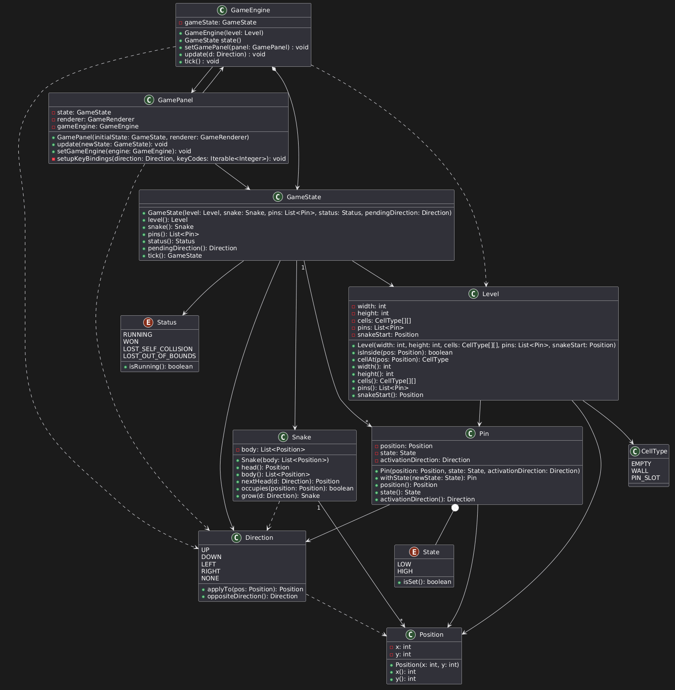

# Praktikum 03 - Lambdas | Method References | Observer Pattern | Swing Events

## 1. [Calculator](https://github.com/029Y4/prog2_ybel_calculator)

## 2. [LockSnake](https://github.com/029Y4/prog2_ybel_locksnake)

### A2.1 **Rudimentäres** Klassendiagramm mit den wichtigsten Klassen für Locksnake

